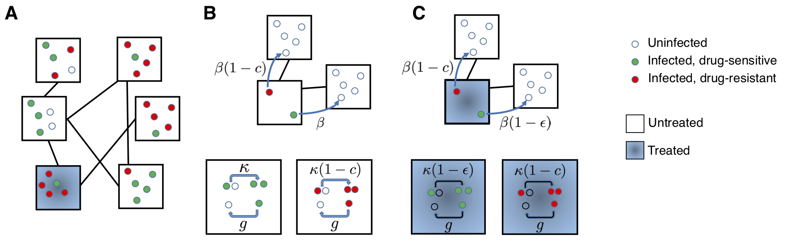
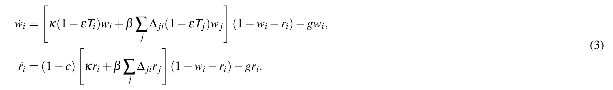

# SpatialAbResistance

This repository contains the Matlab code to simulate competition dynamics of antibiotic-resistant and sensitive strains of infection in structured populations, as described in the paper: Krieger et al, [Population structure across scales facilitates coexistence and spatial heterogeneity of antibiotic-resistant infections](https://www.biorxiv.org/content/10.1101/469171v2), 2020

The file **SpatialResistance.m** is a function to simulate the model shown in Figure 2 in the paper (below), using the system of differential equations in Eq 3 (also below), until equilibrium is reached. 

**Figure 2.** A structured population model for the spread of drug-resistant and drug-sensitive strains of an infection. A) An example population, divided into six equal subpopulations ( “demes”, black squares) of five individuals (circles). Infection can spread within demes, and also between demes that are connected (black lines). Individuals are categorized based on their infection status (uninfected: open circle, infected with drug-sensitive strain: green circle, infected with drug-resistant strain: red circle). The deme where an individual is located may determine whether or not they will receive drug treatment (blue shading), or more generally, their probability of receiving treatment. B) Untreated deme: The wild-type strain (green) is transmitted at rate *κ* within a deme (bottom) and rate *β* between demes (top). Individuals infected with any strain recover with a rate *g*. The resistant strain (red) pays a cost *c* in its transmission rate with or without drug. C) Drug-treated deme: Transmission of the resistant strain is unaffected by whether the source individual is receiving treatment, but transmission of the wild-type strain (green) both within (bottom) and between (top) demes is reduced by a factor (1 − *ε*) if the source individual is treated, where ε is the drug efficacy.

**Equations for spread of resistance in a multi-deme population**: Infection spreads between all individuals in the same deme with rate *κ*, and between any two individuals in different but connected demes at rate *β* . There are *M* demes each of size *D*. Each deme may only be able to spread infection to a sub-set of other demes, and the connectivity of the population is described by the adjacency matrix   (  if an individual in deme *j* can be infected by an individual in deme *i*). The degree of deme *i*,  , is the number of neighbors it is connected to,  . Treatment is assigned at the level of the deme, described by indicator variable   (where  if deme *i* is drug-treated and  otherwise). The fraction of demes that are treated is *ρ*. The system of equations describing the fraction of individuals in each deme who are infected, with either the wild-type ( ) or drug-resistant strain ( ) is:

